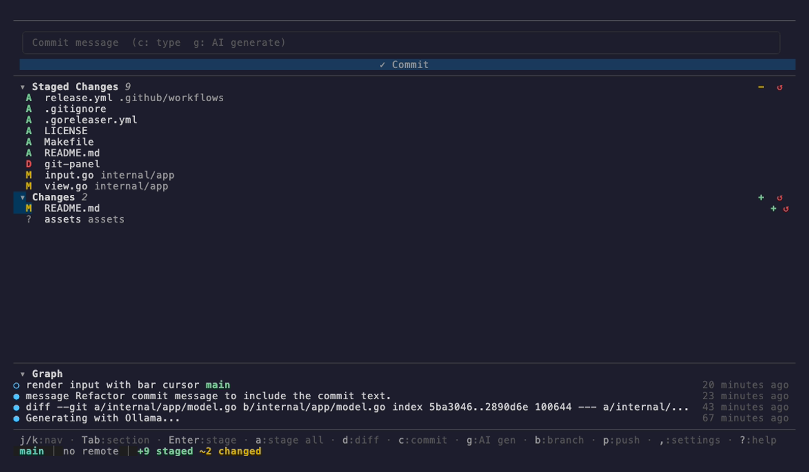
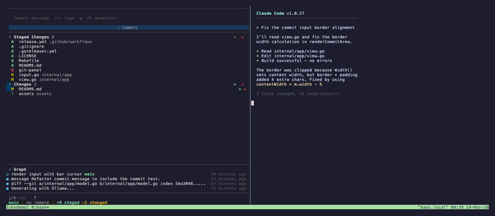
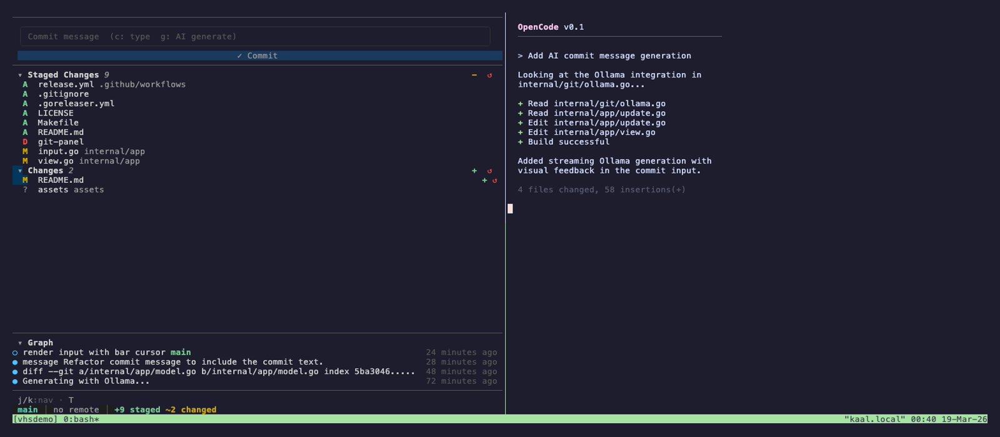
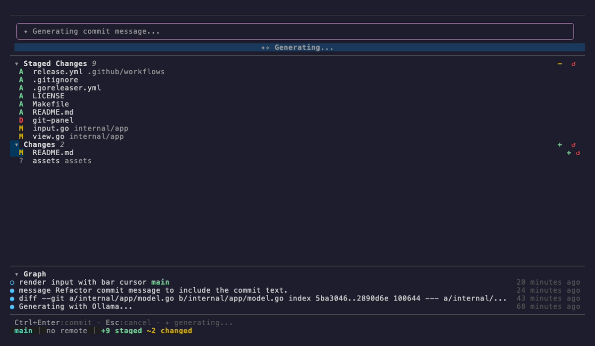

# git-panel

A terminal UI for Git — stage, commit, diff, and browse history without leaving your terminal.


## Demo

<p align="center">
  
</p>

### Split terminal with Claude Code

> git-panel on the left, Claude Code on the right — code with AI, commit with a TUI.

<p align="center">
  
</p>

### Split terminal with OpenCode

> git-panel on the left, OpenCode on the right — two TUIs, one workflow.

<p align="center">
  
</p>

### AI commit message generation

<p align="center">
  
</p>

## Features

- **Stage/unstage** files with keyboard or mouse
- **Commit** with inline message input
- **AI commit messages** via Ollama (local LLM)
- **Diff viewer** with syntax-highlighted hunks
- **Commit graph** with expandable file lists
- **Branch switching**
- **Push/pull/fetch** remote operations
- **Stash** management
- **Mouse support** — click to stage, scroll to navigate
- **Real-time file watching** — UI updates when files change

## Install

### From source

```bash
go install github.com/4nkitd/git-panel/cmd/git-panel@latest
```

### From release binaries

Download from [Releases](https://github.com/4nkitd/git-panel/releases).

### Build locally

```bash
git clone https://github.com/4nkitd/git-panel.git
cd git-panel
make build
```

## Usage

```bash
# Run in current directory
git-panel

# Run in a specific repo
git-panel /path/to/repo

# Or with flag
git-panel -path /path/to/repo

# Show version
git-panel -version
```

## Keybindings

| Key | Action |
|-----|--------|
| `c` | Compose commit message |
| `g` | Generate AI commit message |
| `enter` | Stage/unstage file, or submit commit |
| `a` / `A` | Stage all / Unstage all |
| `d` | Show diff for selected file |
| `b` | Switch branch |
| `p` / `P` | Push / Pull |
| `f` | Fetch |
| `s` / `S` | Stash / Stash pop |
| `z` | Undo last commit |
| `j`/`k` | Navigate up/down |
| `tab` | Cycle sections |
| `?` | Help |
| `,` | Settings |
| `q` | Quit |

## AI Commit Messages (Ollama)

git-panel can generate commit messages using a local Ollama instance.

```bash
# Configure via environment variables
export OLLAMA_HOST=http://localhost:11434
export OLLAMA_MODEL=llama3

# Or configure in-app via Settings (press ,)
```

Press `g` to generate a commit message from your staged diff.

## Requirements

- Go 1.25+ (to build)
- Git
- A terminal with 256-color support
- Ollama (optional, for AI commit messages)

## License

[MIT](LICENSE)
